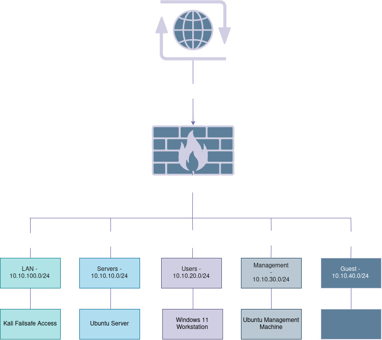

## Current Topology

* The chart will be updated as the project advances.

See [IP addressing](IP-addressing.md)

See [Firewall-policy](Firewall-policy.md)
____

## Design Decisions

### Network Isolation and Internet Connectivity

To isolate the lab from the host machine's physical network, each segment (LAN, Users, Servers, Management, and Guests) is placed on its own VirtualBox Internal Network. Internal networks are only reachable by virtual machines attached to the same network name, so the segments are not exposed to the host or to the external network. 

Outbound internet connectivity is provided through the OPNsense WAN interface, which is connected to a VirtualBox NAT adapter. OPNsense acts as the gateway for the lab segments and forwards permitted outbound traffic through the WAN interface. 

### Segmentation

VirtualBox internal networks behave like unmanaged switches. They have no VLAN awareness and no access or trunk ports, so they cannot assign traffic to a VLAN or add and remove 802.1Q tags on behalf of attached virtual machines. A conventional VLAN-based design would therefore require each guest operating system to tag its own traffic, or an additional VLAN-capable virtual switch. To avoid that complexity, each segment is placed on its own VirtualBox internal network, with a dedicated OPNsense interface for each.

