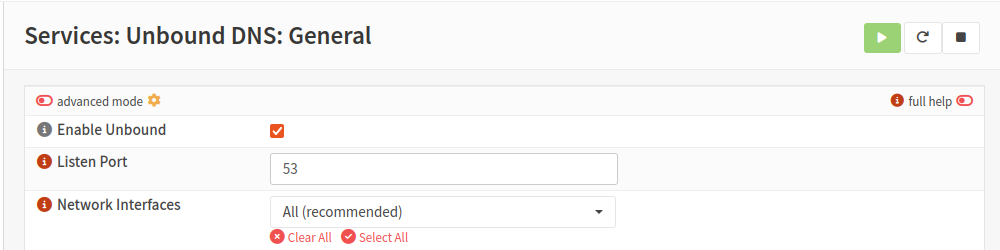
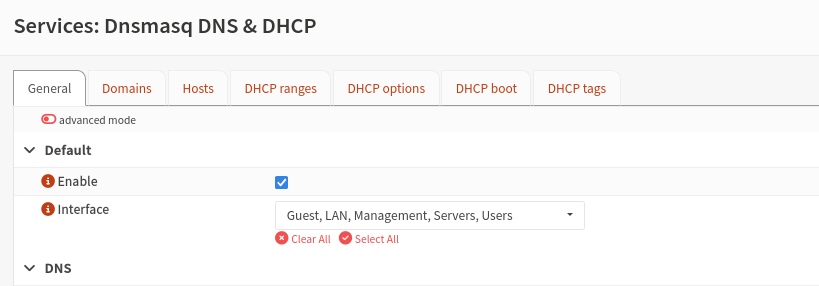
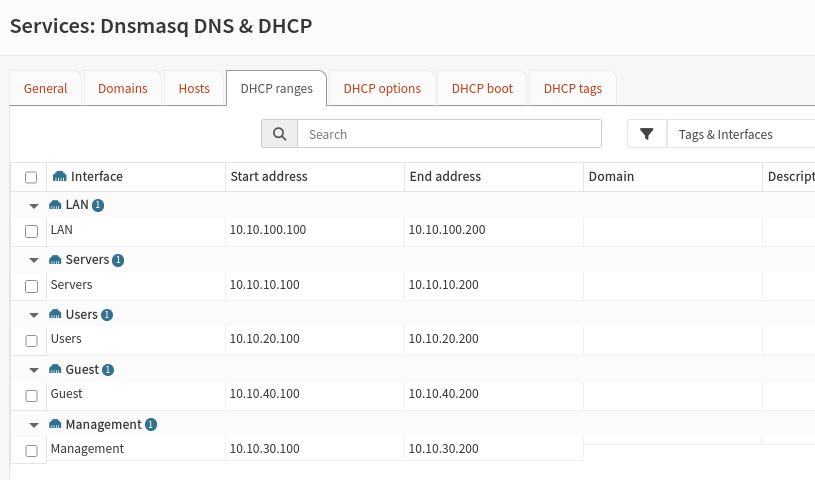

## Interfaces

| **Interface Name** | **VirtualBox Network** | **Device** | **Interface IP Assignment** | **DHCP Server** |
| ------------------ | ---------------------- | ---------- | --------------------------- | --------------- |
| WAN                | NAT                    | em0        | DHCP                        | No              |
| LAN                | intnet                 | em1        | Static IPv4                 | Yes             |
| Servers            | Servers                | em2        | Static IPv4                 | Yes             |
| Users              | Users                  | em3        | Static IPv4                 | Yes             |
| Management         | MGMT                   | em4        | Static IPv4                 | Yes             |
| Guests             | Guest                  | em5        | Static IPv4                 | Yes             |

## Firewall Rules

### Alias Table

| **Alias**              | **Type**   | **Contents**                                                               | **Purpose**                                                     |
| ---------------------- | ---------- | -------------------------------------------------------------------------- | --------------------------------------------------------------- |
| `RFC1918_Networks`     | Network(s) | 10.0.0.0/8, 172.16.0.0/12, 192.168.0.0/16                                  | Private space. Used inverted to mean "Internet"                 |
| `Internal_Lab_Subnets` | Network(s) | 10.10.10.0/24, 10.10.20.0/24, 10.10.30.0/24, 10.10.40.0/24, 10.10.100.0/24 | All five lab segments                                           |
| `Managed_Subnets`      | Network(s) | 10.10.10.0/24, 10.10.20.0/24, 10.10.30.0/24                                | Segments Management can administer (Servers, Users, Management) |
| `Admin_Ports`          | Port(s)    | 22, 443, 3389                                                              | Host administration (SSH, HTTPS, RDP)                           |
| `Firewall_Admin_Ports` | Port(s)    | 22, 443                                                                    | OPNsense administration                                         |
| `Internet_Access`      | Port(s)    | 80, 443                                                                    | Permitted outbound web traffic                                  |

### Custom Rules Table

*Default deny is currently applied by automatically generated OPNsense rule  - see  Automatically Generated  Rules Table*

*! - Refers to inverted destination*

`Aliases are shown in backticks`

| **Rule ID** | **Interface** | **Proto**              | **Source**     | **Source Port** | **Destination**        | **Destination Port**   | **Action** | **Log** | **Purpose**                         |
| ----------- | ------------- | ---------------------- | -------------- | --------------- | ---------------------- | ---------------------- | ---------- | ------- | ----------------------------------- |
| M-1         | Management    | TCP                    | Management Net | Any             | This Firewall          | `Firewall_Admin_Ports` | Allow      | Yes     | Firewall Access                     |
| M-2         | Management    | TCP                    | Management Net | Any             | `Managed_Subnets`      | `Admin_Ports`          | Allow      | Yes     | Infrastructure Admin             |
| M-3         | Management    | ICPM (Echo request) | Management Net | Any             | `Internal_Lab_Subnets` | Any                    | Allow      | No      | Troubleshooting                     |
| M-4         | Management    | TCP/UDP                | Management Net | Any             | 10.10.30.254           | 53                     | Allow      | No      | DNS                                 |
| M-5         | Management    | TCP                    | Management Net | Any             | `!RFC1918_Networks`    | `Internet_Access`      | Allow      | Yes     | Patching & Updates                  |
| U-1         | Users         | TCP/UDP                | Users Net      | Any             | 10.10.20.254           | 53                     | Allow      | No      | DNS                                 |
| U-2         | Users         | TCP                    | Users Net      | Any             | `!RFC1918_Networks`    | `Internet_Access`      | Allow      | No      | Internet Access                     |
| U-3         | Users         | TCP                    | Users Net      | *               | Server Services        | Server Services        | Allow      | Yes     | **Placeholder rule**                |
| U-4         | Users         | Any                    | Users Net      | Any             | `RFC1918_Networks`     | Any                    | Block      | Yes     | Explicit Deny for Internal Networks |
| G-1         | Guests        | TCP/UDP                | Guests Net     | Any             | 10.10.40.254           | 53                     | Allow      | No      | DNS                                 |
| G-2         | Guests        | TCP                    | Guests Net     | Any             | `!RFC1918_Networks`    | `Internet_Access`      | Allow      | No      | Internet Access                     |
| G-3         | Guests        | Any                    | Guests Net     | Any             | `RFC1918_Networks`     | Any                    | Block      | Yes     | Guests Network Isolation            |

* Server rules will be added once the server has been configured.

### Automatically Generated  Rules Table

These rules are created by OPNsense based on system and interface settings. The table below contains a summary of the automatically generated rules. 

| **Rule ID** | **Interface**       | **Dir**  | **Proto** | **Source**                                     | **Destination**                   | **Dest Port** | **Action** | **Purpose**                                                                                           | **Controlled By**                                       |
| ----------- | ------------------- | -------- | --------- | ---------------------------------------------- | --------------------------------- | ------------- | ---------- | ----------------------------------------------------------------------------------------------------- | ------------------------------------------------------- |
| A-1         | Floating (all)      | In       | Any       | Any                                            | Any                               | Any           | Block      | Default deny / state violation rule. Implements the default-deny policy                               | Always present. Logging: Firewall > Settings > Advanced |
| A-2         | Floating (all)      | In       | TCP/UDP   | Any                                            | Any                               | 0             | Block      | Drops invalid port 0 traffic (source-port and destination-port variants)                              | Always present                                          |
| A-3         | Floating (all)      | In       | TCP       | `sshlockout` table                             | This Firewall                     | 22, 443       | Block      | Brute-force protection for SSH and web GUI                                                            | Login protection: System > Settings > Administration    |
| A-4         | Floating (all)      | In       | Any       | `virusprot` table                              | Any                               | Any           | Block      | Blocks hosts that exceed connection limits set on other rules. Empty until such limits are configured | Populated by rules with an overload table               |
| A-5         | Floating (all)      | Out      | Any       | This Firewall                                  | Any                               | Any           | Allow      | Lets the firewall itself originate traffic (updates, DNS, NTP). Documented exception to default deny  | Always present                                          |
| A-6         | WAN                 | In / Out | UDP       | Any                                            | Any                               | 67 / 68       | Allow      | DHCP client, so the WAN can obtain an address from VirtualBox NAT                                     | WAN IPv4 type set to DHCP                               |
| A-7         | WAN                 | In       | Any       | `bogons` / `bogonsv6`                          | Any                               | Any           | Block      | Blocks unallocated (bogon) source addresses                                                           | Interfaces > WAN > Block bogon networks                 |
| A-8         | WAN                 | In       | Any       | RFC1918, loopback, CGNAT, link-local, IPv6 ULA | Any                               | Any           | Block      | Blocks private-address sources arriving on the WAN                                                    | Interfaces > WAN > Block private networks               |
| A-9         | Each DHCP interface | In       | UDP       | Any (port 68)                                  | 255.255.255.255 and This Firewall | 67            | Allow      | Lets clients reach the DHCP server                                                                    | DHCP server enabled per interface                       |
| A-10        | LAN                 | In       | TCP       | Any                                            | This Firewall                     | 80, 443       | Allow      | Anti-lockout. Failsafe firewall GUI access from LAN                                                   | System > Settings > Administration                      |

## Config Notes

### Interface IP assignment

The WAN interface obtains its IP address from the DHCP service built into VirtualBox's NAT engine. All internal interfaces are assigned static IPv4 addresses, and each runs its own DHCP server to provide addresses to the machines attached to that segment.

### DNS

Unbound is used to handle DNS in this lab.

### DHCP

Dnsmasq is used for DHCP in this lab for the following reasons: 
- **Scale:** The lab contains a relatively small number of networks and endpoints.
- **Operational simplicity:** Minimizing infrastructure components makes the initial environment easier to configure, troubleshoot, and document.

