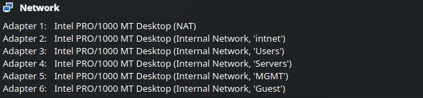

## Why VirtualBox?

Oracle VirtualBox was chosen as the hypervisor for this project for the following reasons: 
1) Hardware limitations 
2) Prior familiarity with the solution
3) Intuitiveness for setting up machines
## Machine Inventory


| **VM**      | **Operating System**        | **Role**               | **Attached Network**                  |
| ----------- | --------------------------- | ---------------------- | ------------------------------------- |
| OPNsense    | OPNsense<br>(26.7.4)        | Firewall / router      | NAT, LAN, Users, Servers, MGMT, Guest |
| Kali        | Kali Linux (2026.2)         | Backup firewall access | LAN                                   |
| Workstation | Windows 11(26H2)            | User endpoint          | Users                                 |
| Server      | Ubuntu Server (26.04.1 LTS) | Server                 | Servers                               |
| Admin       | Ubuntu (26.04.1 LTS)        | Admin Machine          | MGMT                                  |

___

## Network Adapters


| **Adapter ID** | **Attached to**  | **Internal Network Name** | **Purpose**        |
| -------------- | ---------------- | ------------------------- | ------------------ |
| 1              | NAT              | none                      | WAN                |
| 2              | Internal Network | intnet                    | LAN                |
| 3              | Internal Network | Users                     | Users segment      |
| 4              | Internal Network | Servers                   | Servers segment    |
| 5              | Internal Network | MGMT                      | Management segment |
| 6              | Internal Network | Guest                     | Guests segment     |

### Enabling All Required Adapters

By default, the VirtualBox GUI allows one to configure 4 network adapters. By using `VBoxManage` in CLI, up to 8 network adapters can be attached to a machine. 


**Enabling Additional Adapters:**
```Shell
VBoxManage modifyvm "OPNsense" --nic5 intnet
```


**Name the new network:**
```Shell
VBoxManage modifyvm "OPNsense" --intnet5 "MGMT"
```


**Making sure the correct adapter type is defined:**
```Shell
VBoxManage modifyvm "OPNsense" --nictype5 82540EM
```


**Screenshot from OPNsense VM with all adapters:**

